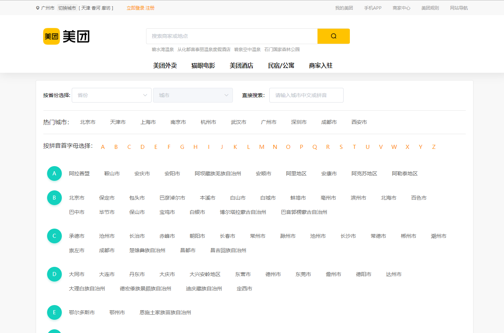
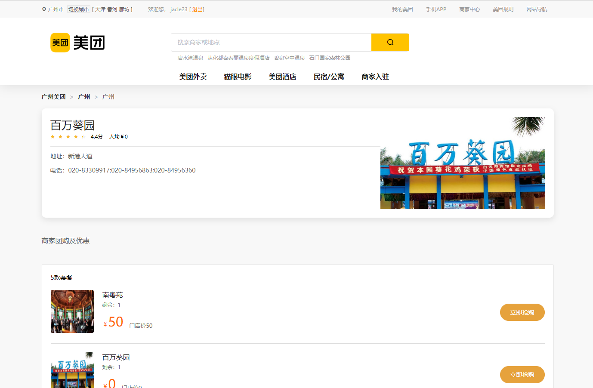
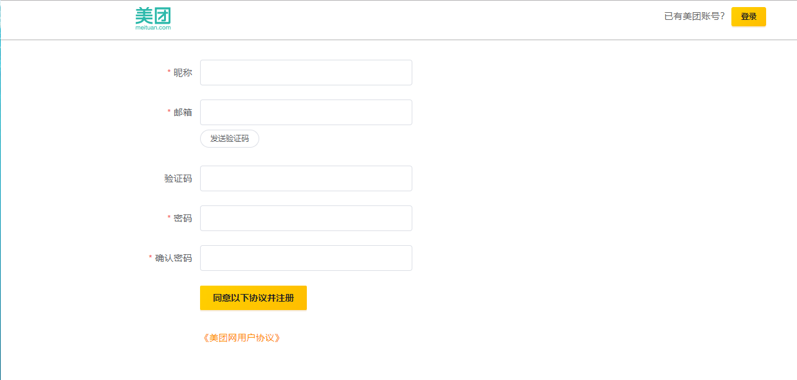

# MeiTuan-app

>  一个基于`Nuxt`的仿制[美团网](https://bj.meituan.com/?pcstyle=1&cevent=imt%2Fft%2Fpc)的练习项目。由慕课网的 Vue全家桶+SSR+Koa2全栈开发美团网 课程学习后做的项目

## 项目截图
#### 首页

#### 切换城市页

#### 产品列表页和详情页

#### 注册页和登录页

#### 购物车页面

## 技术栈
* `Nuxt`： 项目总体框架
* `Element UI`: 项目的UI框架
* `Koa2`：项目服务端框架

## 实现的功能
#### 首页
- [x] 登录状态
- [x] 城市定位服务
#### 切换城市页
- [x] 下拉框选择城市和城市搜索
- [x] 按拼音跳转的城市选择
#### 其他
- [x] 显示产品地理位置
- [x] 注册及登录
......

## 使用方法

``` bash
# install dependencies
$ npm run install

# serve with hot reload at localhost:3000
$ npm run dev

# build for production and launch server
$ npm run build
$ npm run start

# generate static project
$ npm run generate

# PS：生成自己的SMTP密码并写进/server/config.js 的第二十三行，才能使用注册功能
```

